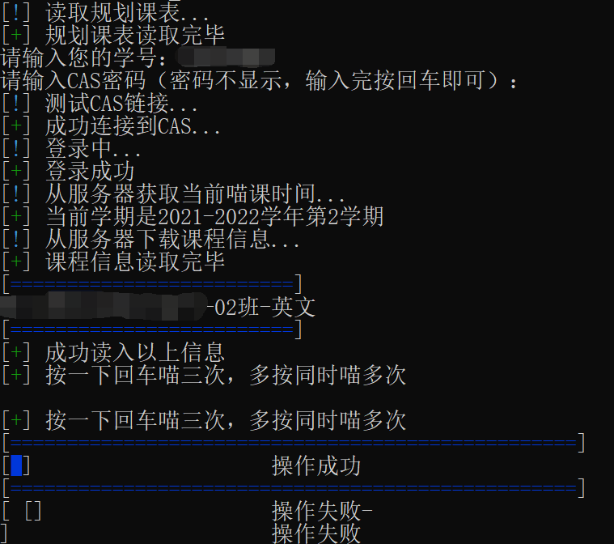

# 南科大Tis选课助手  
**更新 最新一学期服务器证书配置出错，兼容修改请参照issue自行修复**    
  
**该程序未对流量特征做任何的混淆，追求隐蔽性请自行修改**

## 免责声明
**该脚本是通过抽象人对计算机的操作方法，提供节省流量并方便选课的功能。脚本为非营利性开源脚本，仅供个人学习、研究或欣赏使用，采用MIT协议，不具有任何市场价值。开发和使用过程不涉及对任何系统进行逆向破解/反汇编/反编译，本脚本编写使用的一切数据都来源于公开在互联网上的内容。  
本脚本不提供任何明示或暗示的保证，包括但不限于对适销性和特定用途的适用性的暗示保证。 在任何情况下，版权所有人或贡献者均不对任何直接，间接，偶发，特殊，示范性或后果性的损害负责。  
本脚本仅限用于合理合法的学习用途如网络环境测试，因本脚本而产生的各种后果由使用者自行承担，作者对此不负任何责任。**   

## 使用说明  
- main.py为python3编写的主程序，运行即可  
- Class.txt为需要选择的课程列表，一行一个数据，因编码问题，第一行请留空或不要编辑。  
课程列表添加说明（图片加载不出请科学加载）：  
  
  脚本运行界面：

## 更新
最后一次**检测可用**是2023-06-19，检测结果是 **可用**  
- 如果您本地有python3.7+环境并希望手动运行/修改代码[访问源代码](https://github.com/GhostFrankWu/SUSTech_Tools/blob/master/main.py)  
- 如果您本地没有python环境，您可以[使用windows打包版](https://github.com/GhostFrankWu/SUSTech_Tools/releases/tag/v3.1RC1)  

## 声明

**该脚本诞生的目的是研究节省流量，减轻选课系统负担的方法，经过测试确实能达到该效果，因人为修改脚本产生的超过手工频率的流量，由修改者承担责任**  

<!--
| 最新日志 | 目前是否可用 | 时间 | 淘汰原因 
-- | -- | -- | --  
| 取消SSL校验 | √ | 2023-6-19 | - | 
| 更新小学期的选课逻辑 | x | 2022-6-20 | https://github.com/GhostFrankWu/SUSTech_Tools/issues/15 | 
| 学年时间自动获取 | x | 2022-2-12 | 不支持小学期 |  
| 更新学年时间 | x | 2022-2-11 | 新版本可以自动获取学年了 |  
| 更新学年时间 | x | 2021-9-6 | 学年未更新，每学期学年不同 |  
| 课程id自动获取 | x | 2021-9-3 | 学年未更新，每学期学年不同 |  
| tis登录逻辑更新 | x | 2021-1-10 | 课程ID未更新，每学期课程ID不同 |  
| 最早版本 | x | 2021-1-9 | tis登录接口变更 |  

>## TL;DR
>今天有人要向老师举报："是脚本导致了教务系统瘫痪"。  
>- 对，脚本选手都是邪恶的封弊者！   
>  
>经过测试，学生正常使用TIS选课和使用脚本选课的请求情况如下表所示  
>
>项目（三次取平均） | 请求总数(个) | 流量总计(kB) | 总用时(ms)  
>-- | -- | -- | --
>TIS登录 | 17 | 188 | 680
>脚本登录 | 0 | 0 | 0
>TIS登录CAS认证 | 22 | 745 | 1410
>脚本登录CAS认证 | 1 | 11 | 96
>TIS进入 | 141 | 2487 | 8760
>脚本进入 | 4 | 223 | 692
>TIS选课+刷新 | 119 | 1299 | 取决于查询内容1-10秒不等
>脚本选课 | 1 | 0.6 | 177
>TIS总计（刷新n次） | 180+119n | 3350+1299n | 10秒+每次刷新耗时
>脚本总计（选课m次） | 5+m | 234+0.6m | 0.8秒+每次请求144ms
>
>可见在目前的TIS设计下，脚本一秒发送100次请求都不及一位正常学生刷新页面看选课按钮有没有激活产生的请求/流量多。  
>- 所以如果TIS崩了，那最不应该指责是就是如此节省流量脚本用户了（吧？）  
>  
>本人寄网挂科水平，欢迎大佬对以上论述批评指正。

-->
